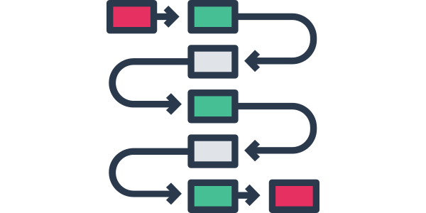

## Processes

If you would like to reduce the time-to-market of your technical documentation assets, you have to improve the authoring and the translation processes.

* I can analyze your authoring and review processes.
* I can organize doc-sprint events to create a huge amount of content in a very short time-frame with your SMEs.

## DITA

The [Darwin Information Typing Architecture (DITA)](https://www.oxygenxml.com/dita/1.3/specs/) is the most powerful open standard for storing information in XML format. Together with the powerful [DITA-OT](https://www.dita-ot.org/) publishing engine you have a set of data and tools to deliver your information in various data standards without the risk to get locked-in to the environment of a vendor. DITA is an open standard, maintained by the [Organization for the Advancement of Structured Information Standards (OASIS)](https://www.oasis-open.org/).

The disadvantage of the flexibility and powerfulness of DITA is complexity. This is the price of the freedom to move your data across CCMS borders. Many of the enterprise CCMS vendors use DITA-XML for storing data and the DITA-OT to render various output formats.

You can use a CCMS for creating your DITA content. But you can also follow the docs-as-code approach and store your DITA content in, for example, a Git repository and use continuous integration technologies to test and deploy your documentation. But, of course, this only works if your have a skilled person that can handle this complexity and supports these technologies and techniques for you.

### Our services

- **Specialization**  
    I help you to master this complexity. I can customize your DITA structure and add new DITA elements and attributes by creating DITA specializations for you using DTD, XSD or RelaxNG grammars.
- **Output**  
    You will not be happy with the default output the DITA-OT will render for you. I can craft new PDF layouts using XSL:FO or CSS rendering engines.
- **Authoring Support**  
    I can implement your style guide autoring rules in [Schematron](https://schematron.com/) to implement real authoring support, e.g. for using the correct elements, formulations, and terms. These rules can also be used for automatically testing your data. When using Git, these tests can help you to avoid low-quality content to leak in to your repository. 