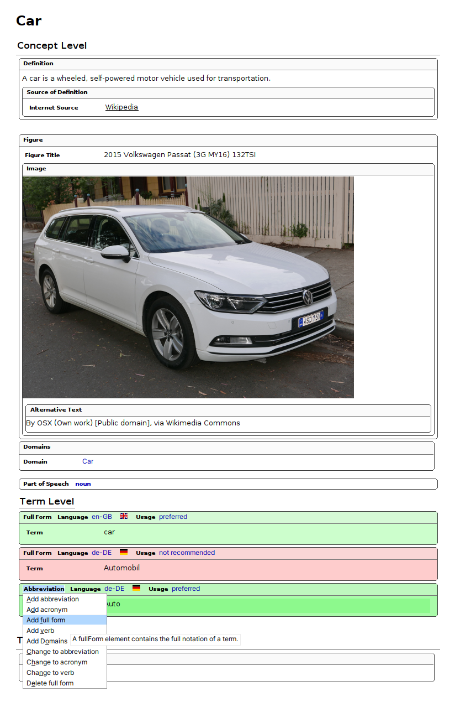

[Parent: Terminology plugin](/plugins/terminology.html)

The basic idea to create a terminology database using the plugin is to create one `<termentry>` topic per terminology concept. A terminology concept contains multiple terms, represented with `<fullForm>`, `<abbreviation>` or acronym elements. A `<termentry>` topic also can have typfied semantical relations to other `<termentry>` topics in the `<relations>` section.

Creating a `<termentry>` topics is very easy when you have installed the Oxygen XML framework, as explained on the [installation](/plugins/terminology-installation.html) page. The following picture shows, how a `<termentry>` topic is rendered in the Oxygen XML Author view. You can find the underlying DITA XML code underneath.



+++ **Example:** car.dita **`<termentry>`** topic
```xml
<?xml version="1.0" encoding="UTF-8"?>
<?xml-model href="urn:jung:dita:rng:termentry.rng" schematypens="http://relaxng.org/ns/structure/1.0"?>
<?xml-model href="urn:jung:dita:rng:termentry.rng" schematypens="http://purl.oclc.org/dsdl/schematron"?>
<termentry id="car">
 <title>Car</title>
 <definition>
  <definitionText>A car is a wheeled, self-powered motor vehicle used for transportation.</definitionText>
  <definitionSource>
   <sourceReference href="https://en.wikipedia.org/wiki/Car" format="html" scope="external"
    >Wikipedia</sourceReference>
  </definitionSource>
 </definition>
 <termBody>
  <fig>
   <title>2015 Volkswagen Passat (3G MY16) 132TSI</title>
   <image href="https://upload.wikimedia.org/wikipedia/commons/7/78/2015_Volkswagen_Passat_%283G_MY16%29_132TSI_station_wagon_%282015-11-11%29_01.jpg" scope="external" width="600px">
    <alt>By OSX (Own work) [Public domain], via Wikimedia Commons</alt>
   </image>
  </fig>
  <domains>
   <domain concept-domain="Car"/>
  </domains>
  <partOfSpeech/>
  <fullForm usage="preferred" language="en-GB">
   <termVariant xml:lang="en-GB">car</termVariant>
  </fullForm>
  <fullForm usage="notRecommended" language="de-DE">
   <termVariant xml:lang="de-DE">Automobil</termVariant>
  </fullForm>
  <abbreviation usage="preferred" language="de-DE">
   <termVariant xml:lang="de-DE">Auto</termVariant>
  </abbreviation>
 </termBody>
 <relations>
  <relatedTerms>
   <relatedTerm keyref="truck"/>
  </relatedTerms>
 </relations>
</termentry>
```
+++


**org.jung.terminology** ships a comprehensive set of sample files, that show you how to create terms and create the various outputs. The samples contain a DITA-OT project file with predefined transformations to create termchecker files, termbrowser, and so forth. If you don't know what a DITA-OT project file is, read [dita-ot.org - Publishing with project files](https://www.dita-ot.org/dev/topics/using-project-files). You can read more about how to publish with a DITA-OT project file in the [Oxygen XML documentation](https://www.oxygenxml.com/doc/versions/26.1/ug-editor/topics/publishing_with_a_dita_ot_project_file.html?hl=publishing%2Cdita-ot%2Cproject%2Cfile). To test the transformations, just open the `terminology.ditamap` in the oXygen DITA Maps Manager and run a transformation scenario.

> <i class="fa-solid fa-triangle-exclamation"></i> **CAUTION** **`<termentry>`** topics are not meant to be used or reused in a normal DITA project, they are just used for storing the terminology.

> <i class="fas fa-circle-info"></i> **INFO** If you have found a bug or want to request a feature, please raise a <i class="fa-brands fa-github"></i> [GitHub issue](https://github.com/stefan-jung/org.jung.terminology/issues).