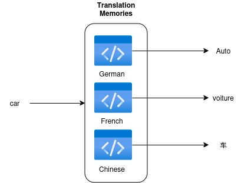



Parent: <a class="crumb" href="{{ crumb.url | url }}">{{ crumb.title }}</a>


[org.jung.terminology](https://github.com/stefan-jung/org.jung.terminology) is a full-blown terminology management solution for DITA/Oxygen XML authoring environments. Technically speaking it's a plugin for the [Oxygen Publishing Engine](https://www.oxygenxml.com/publishing_engine.html) and the [DITA-OT](http://dita-ot.github.io/). The plugin ships the specialized **`<termentry>`** topic type and a few others. The **`<termentry>`** represents a single terminology concept and contains all metadata and all linguistic information of the terminology concept in all languages.

Creating a **`<termentry>`** topic is as easy as creating a normal DITA topic. The plugin ships also a comprehensive Oxygen XML framework for authoring. The following picture shows, how a **`<termentry>`** topic is rendered in the Oxygen XML Author view.


This is the underlying XML structure.

```xml
<?xml version="1.0" encoding="UTF-8"?>
<?xml-model href="urn:jung:dita:rng:termentry.rng" schematypens="http://relaxng.org/ns/structure/1.0"?>
<?xml-model href="urn:jung:dita:rng:termentry.rng" schematypens="http://purl.oclc.org/dsdl/schematron"?>
<termentry id="car">
 <title>Car</title>
 <definition>
  <definitionText>A car is a wheeled, self-powered motor vehicle used for transportation.</definitionText>
  <definitionSource>
   <sourceReference href="https://en.wikipedia.org/wiki/Car" format="html" scope="external"
    >Wikipedia</sourceReference>
  </definitionSource>
 </definition>
 <termBody>
  <fig>
   <title>2015 Volkswagen Passat (3G MY16) 132TSI</title>
   <image href="https://upload.wikimedia.org/wikipedia/commons/7/78/2015_Volkswagen_Passat_%283G_MY16%29_132TSI_station_wagon_%282015-11-11%29_01.jpg" scope="external" width="600px">
    <alt>By OSX (Own work) [Public domain], via Wikimedia Commons</alt>
   </image>
  </fig>
  <domains>
   <domain concept-domain="Car"/>
  </domains>
  <partOfSpeech/>
  <fullForm usage="preferred" language="en-GB">
   <termVariant xml:lang="en-GB">car</termVariant>
  </fullForm>
  <fullForm usage="notRecommended" language="de-DE">
   <termVariant xml:lang="de-DE">Automobil</termVariant>
  </fullForm>
  <abbreviation usage="preferred" language="de-DE">
   <termVariant xml:lang="de-DE">Auto</termVariant>
  </abbreviation>
 </termBody>
 <relations>
  <relatedTerms>
   <relatedTerm keyref="truck"/>
  </relatedTerms>
 </relations>
</termentry>
``````


 **`<termentry>`** topics are not meant to be used or reused in a normal DITA project, they are just used for storing the terminology. It is possible to generate a terminology browser from your **`<termentry>`** topics, which allows others to navigate to your terminology. You will find several examples in the `samples` directory of the plugin.

> <i class="fas fa-circle-info"></i> **INFO** If you have found a bug or want to request a feature, please raise a <i class="fa-brands fa-github"></i> [GitHub issue](https://github.com/stefan-jung/org.jung.terminology/issues).


Main Features
=============

* Create and change terms easily using specialized DITA topics. The new DITA `<termentry>` topic represents a single terminology concept. Terminology concepts are linked together to a terminology database using the new DITA `<termmap>` map.
* Author terminology concepts easily using an <oXygen/> XML framework, which is providing author mode stylesheets, which simplify the editing of `<termentry>` and `<termmap>` topics and maps.
* Terminology Harvester, to harvest terms from translation memories (.tmx) or XLIFF files (.xlf or .xliff).

**Quick Start Presentation**: Recorded by [Syncro Soft/OxygenXML Editor](https://www.oxygenxml.com/about_us.html), DITA-OT Day 2016, Munich

<!-- Slides: [https://doctales.github.io/presentations/presentation-dita-ot-day/index.html](https://doctales.github.io/presentations/presentation-dita-ot-day/index.html) -->
  

Termbrowser
-----------

The termbrowser is designed to browse through your terminology database. You can find an example generated from the provided sample files here: [stefanjung.netlify.app/termbrowser](https://stefanjung.netlify.app/termbrowser/). The termbrowser also contains a [semantic net](https://stefanjung.netlify.app/termbrowser/semantic-net/) and displays [statistics](https://stefanjung.netlify.app/termbrowser/semantic-net/termstats.html).


Termchecker
-----------

The termchecker is designed to search for not recommended terms in various data formats.

*   [Termchecker XLIFF](/wiki/spaces/DOC/pages/40008144/Termchecker+XLIFF) — This page explains how to use the termchecker for XLIFF. The Termchecker XLIFF (as the [Termchecker DITA](/wiki/spaces/DOC/pages/40008098/Termchecker+DITA)) is technically a [Schematron](http://www.schematron.com/) file, that searches for not recommended terms and replaces them with preferred synonyms. It is recommended [add a new document type association](http://www.oxygenxml.com/doc/versions/19.0/ug-editor/topics/preferences-document-type-association.html) by extending the `XLIFF` framework and [create a new validatation scenario](https://www.oxygenxml.com/doc/versions/18/ug-editor/tasks/create-validation-scenario.html) using the termchecker XLIFF Schematron file.
    
*   [Termchecker DITA](/wiki/spaces/DOC/pages/40008098/Termchecker+DITA) — This page explains how to use the termchecker for DITA. The DITA Termchecker is technically a [Schematron](http://www.schematron.com/) file, that searches for not recommended terms and replaces them with preferred synonyms. It is recommended [add a new document type association](http://www.oxygenxml.com/doc/versions/19.0/ug-editor/topics/preferences-document-type-association.html) by extending the `DITA` framework and [create a new validatation scenario](https://www.oxygenxml.com/doc/versions/18/ug-editor/tasks/create-validation-scenario.html) using the termchecker DITA Schematron file.
    

TBX
---

TBX is a data format to exchange a terminology database, e.g. to pass it to your Language Service Provider (LSP).

*   [TBX-Basic](/wiki/spaces/DOC/pages/40008215/TBX-Basic) — The transformation scenario `TBX-Basic` transforms the terminology to a [TBX-Basic](http://www.ttt.org/oscarstandards/tbx/tbx-basic.html) file. A TBX-Basic file is a lighter version of the Terminology Base Exchange (TBX) format. You can send this file to a language service provider to make sure, that the translator uses the correct terminology during translation.
    
*   [TBX-Min](/wiki/spaces/DOC/pages/40008179/TBX-Min) — The transformation scenarios `TBX-Min` transforms the terminology to a TBX-Min file. The TBX-Min format is a dialect of the TermBase eXchange (TBX) format and is designed for bilingual or monolingual glossaries. You can use TBX-Min to transmit a terminology database to a language service provider (LSP). You can send this file to a language service provider to make sure, that the translator uses the correct terminology during translation. The TBX-Min format is explained in the paper [TBX - Min: A Simplified TBX - Based Approach to Representing Bilingual Glossaries](http://www.tbxinfo.net/wp-content/uploads/2016/10/lommel_melby_glenn_hayes_snow-final.pdf).


Terminology Harvester
---------------------

It is always a good idea to maintain and harmonize your translation memories and your terminology database. During this work, you will identify inconsistencies that you can map into your terminology using non-permissible terms and eliminate them in the long term.

The clear solution is of course to prepare a terminological concept before the first translation and to clearly define the associated terms in all target languages. In practice, however, this is often not feasible and often not even desirable for economic reasons.

The Terminology Harvester is crawling through translation memories and XLIFF files and is extracting translated terms as **`<termentry>`** topics, `.csv`, or `.txt` files. The Terminology Harvester intentionally only checks the segments in which the term being searched for occurs exclusively. Segments in which the term is embedded in a sentence structure are deliberately ignored.


  

Installation
============

Prerequisites
-------------

*   DITA-OT 3.x or DITA-OT 4.x
*   oXygen XML 23 or higher

  

Install the plugin to the DITA-OT
---------------------------------

You can install the plugin to the DITA-OT with a single command:

```xml
dita --install https://github.com/stefan-jung/org.jung.terminology/archive/master.zip
```

  

Installing the oXygen Framework
---------------------------

The oXygen framework helps you to author your terminology database. It consists of oXygen styles and actions that help you create and edit terms.

1.  In oXygen XML open the menu `Options` > `Preferences`.
2.  In the preferences, open `Document Type Association` > `Locations`.
3.  Add the directory of the plugin, e.g. `/home/user/workspace/DITA/dita-ot/plugins/org.jung.terminology`.

  

Using the plugin
================

**org.jung.terminology** ships a few sample files, that show you how to create terms and create the various outputs. To test the transformations, just open the `terminology.ditamap` in the oXygen DITA Maps Manager and run a transformation scenario.

This page explains how to use the termchecker for DITA. The DITA Termchecker is technically a [Schematron](http://www.schematron.com/) file, that searches for not recommended terms and replaces them with preferred synonyms. It is recommended [add a new document type association](http://www.oxygenxml.com/doc/versions/19.0/ug-editor/topics/preferences-document-type-association.html) by extending the `DITA` framework and [create a new validatation scenario](https://www.oxygenxml.com/doc/versions/18/ug-editor/tasks/create-validation-scenario.html) using the termchecker DITA Schematron file.


**Table of Contents**

*   [Parameters](#TermcheckerDITA-Parameters)
*   [Publishing a Termchecker for DITA using the dita command](#TermcheckerDITA-PublishingaTermcheckerforDITAusingtheditacommand)
*   [Publishing a Termchecker for DITA from oXygen XML](#TermcheckerDITA-PublishingaTermcheckerforDITAfromoXygenXML)

#### Parameters

The termchecker for DITA transformation supports the following parameters, that can be passed with `-Dparameter=value` to the dita command. You can find more information about parameters on [Building output using the dita command](http://www.dita-ot.org/dev/user-guide/build-using-dita-command.html).

| Parameter       | Values  | Description                             |
|-----------------|---------|-----------------------------------------|
| `args.language` | `de-DE` | Language of the terminology check rules |


#### Publishing a Termchecker for DITA using the dita command

You can find more information about the dita command on [Building output using the dita command](http://www.dita-ot.org/dev/user-guide/build-using-dita-command.html).

  

**Example**

```xml
dita --input terminology.ditamap --format termchecker-dita -Dargs.language=en-GB --output termchecker-dita
```

#### Publishing a Termchecker for DITA from oXygen XML

1.  Open the samples DITA map `~/org.stefan.jung.terminology/samples/terminology.ditamap` in the oXygen DITA Maps Manager.
2.  In the `Transformation Scenarios` view, double click the entry `Termchecker for DITA`.  
      
      
    The terminology is transformed to the Schematron file `~/out/termchecker-dita/terminology-DITA-en-GB.sch`. By default, the terminology checker is generated for British English (`en-GB`). If you want to generate the terminology checker for another language, you have to change the parameter `args.language` of the transformation scenario.
3.  Create a new DITA validation scenario and refer to the generated Schematron file.
    1.  In oXygen open the menu `Options` > `Preferences`.
    2.  In the `Document Type Association` menu, select the `DITA` document type association and click the button`Edit`.
    3.  Open the `Validation` tab and click the + button, to create a new validation scenario.
    4.  Create a new validation scenario named `Terminology` and specify the Schematron schema.
        
4.  Create a new DITA topic.
5.  Set the `xml:lang` attribute of the topic to `en-GB` and write the word `truck` somewhere in the topic.  
    The term violation is indicated with a small lamp icon. Click on the lamp select the `Replace with an allowed term`action. This works both in text and in author mode.
      
    The deprecated term has been replaced.

**Explanation**

The deprecated and the allowed term notations are defined in the `truck.dita` file.

```xml
<fullForm usage="notRecommended" language="en-GB">
  <termVariant>truck</termVariant>
</fullForm>
<fullForm usage="preferred" language="en-GB">
  <termVariant>lorry</termVariant>
</fullForm>
```


This page explains how to use the termchecker for XLIFF. The Termchecker XLIFF (as the [Termchecker DITA](Termchecker-DITA_40008098.html)) is technically a [Schematron](http://www.schematron.com/) file, that searches for not recommended terms and replaces them with preferred synonyms. It is recommended [add a new document type association](http://www.oxygenxml.com/doc/versions/19.0/ug-editor/topics/preferences-document-type-association.html) by extending the `XLIFF` framework and [create a new validatation scenario](https://www.oxygenxml.com/doc/versions/18/ug-editor/tasks/create-validation-scenario.html) using the termchecker XLIFF Schematron file.


#### Parameters

| Parameter             | Values                                       | Description                                                                                          |
|-----------------------|----------------------------------------------|------------------------------------------------------------------------------------------------------|
| `args.check.elements` | `source`, `target`, `both` Default: `source` | Choose whether terms should be checked only in source elements or target elements or in both of them |
| `args.language`       | Example: `de-DE`                             | Language of the terminology check rules                                                              |


The DITA Termbrowser Responsive (format: `termbrowser-reponsive`) is a reponsive website for browsing through your terminology database.

The _termbrowser responsive_ is based on the oXygen plugin **com.oxygenxml.webhelp.responsive** (**com.oxygenxml.webhelp** before <oXygen/> 19.1) and is used to browse through the terminology database.

#### Prerequisites

To publish the _termbrowser responsive_, you need to have the plugins **com.oxygenxml.webhelp.responsive** and **com.oxygenxml.webhelp.common** (since <oXygen/> 19.1) installed to your DITA-OT. This means, you need to use the DITA-OT which is shipped with Oxygen XML (because it contains all those plugins) or you need to use the [Oxygen Publishing Engine](https://www.oxygenxml.com/publishing_engine.html), if you want to use this on a server.

If you want to publish the _termbrowser responsive_ via command line interface, you need an additional license, see [Buy Oxygen XML WebHelp](https://www.oxygenxml.com/xml_webhelp/buy_oxygen_xml_webhelp.html).


#### Parameters

| Parameter               | Values                      | Description                                                                                                                                                                                                                                                                                                          |
|-------------------------|-----------------------------|----------------------------------------------------------------------------------------------------------------------------------------------------------------------------------------------------------------------------------------------------------------------------------------------------------------------|
| `args.default.language` | Example: `en-GB`            | Language used to generate the termbrowser labels.                                                                                                                                                                                                                                                                    |
| `args.termstats`        | Example: `../termstats.xml` | Relative path to the terminology statistics (`termstats.xml` file). The `termstats.xml` file is automatically generated with each termbrowser publication. If you pass the `termstats.xml` from the previous build with this parameter, you can generate a&nbsp;chronological sequence of your terminology metadata. |


#### Example

```xml
dita --input terminology.ditamap --format termbrowser-responsive -Dargs.default.language=en-GB --output out/termbrowser-responsive
```


The transformation scenarios `TBX-Min` transforms the terminology to a TBX-Min file. The TBX-Min format is a dialect of the TermBase eXchange (TBX) format and is designed for bilingual or monolingual glossaries. You can use TBX-Min to transmit a terminology database to a language service provider (LSP). You can send this file to a language service provider to make sure, that the translator uses the correct terminology during translation. The TBX-Min format is explained in the paper [TBX - Min: A Simplified TBX - Based Approach to Representing Bilingual Glossaries](http://www.tbxinfo.net/wp-content/uploads/2016/10/lommel_melby_glenn_hayes_snow-final.pdf).

| Parameters | Values | Description |
|------------|--------|-------------|
| `args.source.language` | **Example**: `de-DE` (German/Germany) | Source language of terminology |
| `args.target.language` | **Example**: `en-GB` (English/Great Britain) | Target language of terminology |


The transformation scenario `TBX-Basic` transforms the terminology to a [TBX-Basic](http://www.ttt.org/oscarstandards/tbx/tbx-basic.html) file. A TBX-Basic file is a lighter version of the Terminology Base Exchange (TBX) format. You can send this file to a language service provider to make sure, that the translator uses the correct terminology during translation.


#### Parameters

| Parameters | Values | Description |
|-------------------------|-----------------------------|----------------------------------------------------------------------------------------------------------------------------------------------------------------------------------------------------------------------------------------------------------------------------------------------------------------------|
| args.source.language | **Example**: `de-DE` | The source language of the terms. |
| args.target.language | **Example**: `de-DE` | The target language of the terms. |

