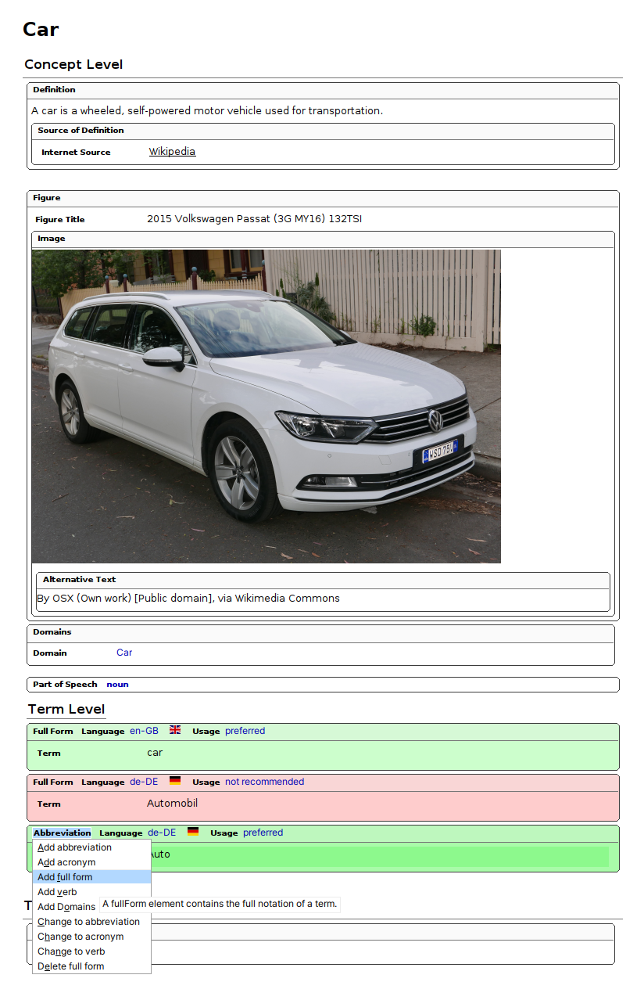



Parent: <a class="crumb" href="{{ crumb.url | url }}">{{ crumb.title }}</a>


[org.jung.terminology](https://github.com/stefan-jung/org.jung.terminology) is a full-blown terminology management solution for DITA/Oxygen XML authoring environments. Technically speaking it's a plugin for the [Oxygen Publishing Engine](https://www.oxygenxml.com/publishing_engine.html) and the [DITA-OT](http://dita-ot.github.io/). The plugin ships the specialized **`<termentry>`** topic type and a few others. The **`<termentry>`** represents a single terminology concept and contains all metadata and all linguistic information of the terminology concept in all languages.

Creating a **`<termentry>`** topic is as easy as creating a normal DITA topic. The plugin ships also a comprehensive Oxygen XML framework for authoring. The following picture shows, how a **`<termentry>`** topic is rendered in the Oxygen XML Author view.



+++ **Example:** car.dita **`<termentry>`** topic
```xml
<?xml version="1.0" encoding="UTF-8"?>
<?xml-model href="urn:jung:dita:rng:termentry.rng" schematypens="http://relaxng.org/ns/structure/1.0"?>
<?xml-model href="urn:jung:dita:rng:termentry.rng" schematypens="http://purl.oclc.org/dsdl/schematron"?>
<termentry id="car">
 <title>Car</title>
 <definition>
  <definitionText>A car is a wheeled, self-powered motor vehicle used for transportation.</definitionText>
  <definitionSource>
   <sourceReference href="https://en.wikipedia.org/wiki/Car" format="html" scope="external"
    >Wikipedia</sourceReference>
  </definitionSource>
 </definition>
 <termBody>
  <fig>
   <title>2015 Volkswagen Passat (3G MY16) 132TSI</title>
   <image href="https://upload.wikimedia.org/wikipedia/commons/7/78/2015_Volkswagen_Passat_%283G_MY16%29_132TSI_station_wagon_%282015-11-11%29_01.jpg" scope="external" width="600px">
    <alt>By OSX (Own work) [Public domain], via Wikimedia Commons</alt>
   </image>
  </fig>
  <domains>
   <domain concept-domain="Car"/>
  </domains>
  <partOfSpeech/>
  <fullForm usage="preferred" language="en-GB">
   <termVariant xml:lang="en-GB">car</termVariant>
  </fullForm>
  <fullForm usage="notRecommended" language="de-DE">
   <termVariant xml:lang="de-DE">Automobil</termVariant>
  </fullForm>
  <abbreviation usage="preferred" language="de-DE">
   <termVariant xml:lang="de-DE">Auto</termVariant>
  </abbreviation>
 </termBody>
 <relations>
  <relatedTerms>
   <relatedTerm keyref="truck"/>
  </relatedTerms>
 </relations>
</termentry>
```
+++

> <i class="fa-solid fa-triangle-exclamation"></i> **CAUTION** **`<termentry>`** topics are not meant to be used or reused in a normal DITA project, they are just used for storing the terminology.

> <i class="fas fa-circle-info"></i> **INFO** If you have found a bug or want to request a feature, please raise a <i class="fa-brands fa-github"></i> [GitHub issue](https://github.com/stefan-jung/org.jung.terminology/issues).


Main Features
=============

* Create and change terms easily using specialized DITA topics. The new DITA `<termentry>` topic represents a single terminology concept. Terminology concepts are linked together to a terminology database using the new DITA `<termmap>` map.
* Author terminology concepts easily using an <oXygen/> XML framework, which is providing author mode stylesheets, which simplify the editing of `<termentry>` and `<termmap>` topics and maps.
* **Termbrowser** - Generate a responsive website for browsing through your terminology. Read more on [Terminology browser](/plugins/termbrowser.html)
* **Oxygen Terminology Checker** - Generate terminology checker rules for the [Oxygen Terminology Checker Add-on](https://www.oxygenxml.com/doc/versions/26.1/ug-editor/topics/terminology-checker-addon.html). Read more on [Oxygen Terminology Checker](/plugins/terminology-oxygen-terminology-checker.html). 
* **Termchecker for DITA and XLIFF** - Check terminology in DITA and XLIFF files with Schematron rules. Read more on [Termchecker for DITA and XLIFF](/plugins/terminology-checker-dita-xliff.html).
* **Terminology Harvester** - Harvest new terms from translation memories (.tmx) or XLIFF files (.xlf or .xliff). Read more on [Terminology Harvester](/plugins/terminology-harvester.html).
* **TBX/MARTIF** - You can generate TermBase eXchange (TBX) files to share your terminology with your translation vendor. Read more on [TermBase eXchange (TBX)/MARTIF](/plugins/terminology-tbx.html).


Next steps
==========

* **Installation** - If you would like to install the plugin, follow the [installation instructions](/plugins/terminology-installation.html).
* **Using the plugin** - If you would like to start using the plugin, follow the [usage instructions](/plugins/terminology-usage.html).